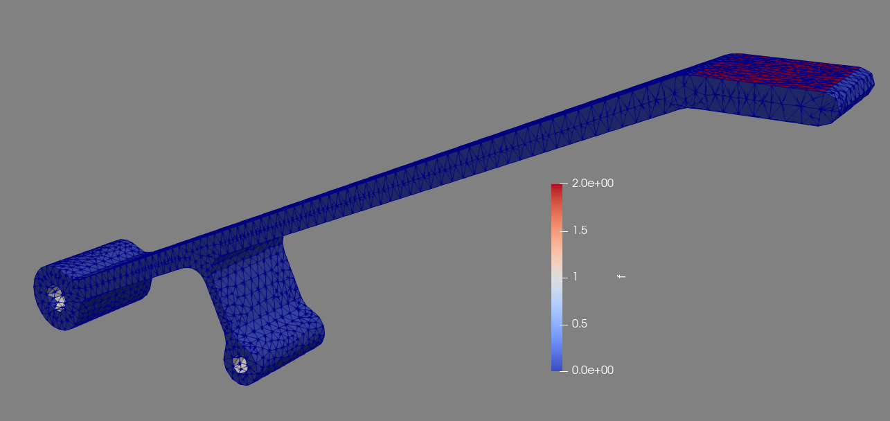

Imported Mesh
=============

In this example we will import a mesh from a CAD file and use FEniCS to model its displacement. This file was created in Autodesk Inventor and exported as an .igs file, which can be downloaded :download:`here <../mesh_1/mesh_1.igs>`. To convert it to a a Gmsh .msh file, run this line in the command line::

	gmsh -3 -clmax 1 -o mesh.msh mesh_1.igs

The ``-3`` flag creates a 3D mesh and the ``-clmax 1`` flag sets the max size of an element to 1 to help with the smoothing of the holes in the model. We then use another command to convert the .msh file to a .xml file for Dolfin::

	dolfin-convert mesh.msh mesh.xml

We can now import the mesh into a FEniCS script and write it out to a .pvd file with no marked regions to preview the mesh geometry::

	from dolfin import *
	
	mesh = Mesh('mesh.xml')
	
	folder_name = './mesh1_results'
	
	regions = MeshFunction('size_t', mesh, mesh.topology().dim()-1)
	regions.set_all(0)
	
	regionfile = File('%s/regions.pvd' % folder_name)
	regionfile << regions

We get this when we open the .pvd file in ParaView.

.. image:: mesh_1/generated_mesh.png

This piece is a small aluminum component designed to hold a load of up to :math:`20\text{N}` on the top platform while deflecting less than :math:`1\text{mm}`. Let's use FEniCS to see if it meets the specifications.

First, let's define the fixed regions and loaded regions in the mesh::

	from dolfin import *
	import numpy as np
	import region_selector_3d as rs
	
	mesh = Mesh('mesh.xml')
	folder_name = './mesh1_results'
	
	fixedPin1 = rs.GetCylindricalRegion(Point(0.0,0.0,5.0), Point(0.0,0.0,-5.0), 1.6)
	fixedPin2 = rs.GetCylindricalRegion(Point(25.0,0.0,5.0), Point(25.0,0.0,-5.0), 1.1)
	loadFace = rs.GetPlanarBoundary.from_coord('y', 31.0)
	
	regions = MeshFunction('size_t', mesh, mesh.topology().dim()-1)
	regions.set_all(0)
	fixedPin1.mark(regions, 1)
	fixedPin2.mark(regions, 1)
	loadFace.mark(regions, 2)
	
	regionfile = File('%s/regions.pvd' % folder_name)
	regionfile << regions
	
	ds = Measure('ds', domain = mesh, subdomain_data = regions)

We can now view the marked faces in ParaView:

We now define the load and material properties and set up the simulation as in the previous examples. Note that in this case we cannot use the ``area()`` method of the planar boundary class because it was not defined using a set of four corners that perfectly fit the mesh, so the returned area of the region won't match the actual selected area. Instead, we use the ``assemble()`` function which returns the integral of what's passed to it. In this case, the area is :math:`\int_\Omega 1*ds` where :math:`\Omega` is the load region. The area of the load region can be found with ``assemble(Constant(1.0)*ds(2))`.

::

	E = 69800.0
	nu = 0.33
	mu = E / (2.0 * (1.0 + nu))
	lmbda = E * nu / ((1.0 + nu) * (1.0 - 2.0*nu))
	
	appliedLoad = Constant((0.0,-20.0,0.0)) # [N]
	loadArea = assemble(Constant(1.0) * ds(2))
	scaledLoad = appliedLoad / loadArea
	
	def eps(u):
		return sym(grad(u))
	
	def sigma(u):
		return lmbda*tr(eps(u)) * Identity(mesh.topology().dim()) + 2.0*mu*eps(u)
	
	V = VectorFunctionSpace(mesh, "Lagrange", 2)
	du = TrialFunction(V)
	u = Function(V, name = "Displacement")
	v = TestFunction(V)
	
	a = inner(sigma(du), eps(v))*dx
	L = dot(scaledLoad, v) * ds(2)

We define two separate boundary conditions, one for each pin. For simplicity's sake we treat the surfaces which contact the pins as fixed rather than pinned, which in this example is a good enough approximation::

	bc1 = DirichletBC(V, Constant((0.0,0.0,0.0)), fixedPin1)
	bc2 = DirichletBC(V, Constant((0.0,0.0,0.0)), fixedPin2)
	
	solve(a == L, u, [bc1, bc2])
	
	u.rename("Displacement", "Displacement")
	xdmf_file = XDMFFile('%s/results.xdmf' % folder_name)
	xdmf_file.write(u,1.0)

When we run the simulation we find that the maximum displacement is about :math:`2.0\text{mm}`, which does not meet the specifications for the part.

-------------
Complete Code
-------------
The complete code follows and can also be downloaded :download:`here </code/mesh1.py>`.

.. literalinclude:: /code/mesh1.py
   :language: python