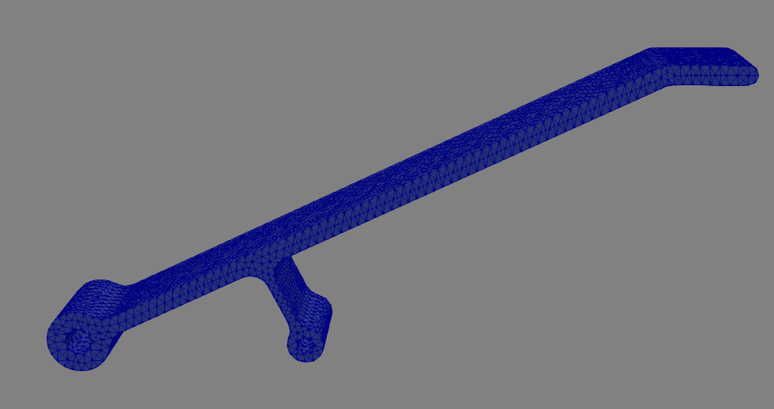

Imported Mesh
=============

In this example we will import a mesh from a CAD file and use Fenics to model its displacement. This file was created in Autodesk Inventor and exported as an .igs file, which can be downloaded :download:`here <../mesh_1.igs>`. To convert it to a a Gmsh .msh file, run this line in the command line::

	gmsh -3 -clmax 1 -o mesh.msh mesh_1.igs

The ``-3`` flag creates a 3D mesh and the ``-clmax 1`` flag sets the max size of an element to 1 to help with the smoothing of the holes in the model. We then use another command to convert the .msh file to a .xml file for Dolfin::

	dolfin-convert mesh.msh mesh.xml

We can now import the mesh into a Fenics script and write it out to a .pvd file with no marked regions to preview the mesh geometry::

	from dolfin import *
	import numpy as np
	import region_selector_3d as rs
	
	mesh = Mesh('mesh.xml')
	
	folder_name = './mesh1_results'
	
	regions = MeshFunction('size_t', mesh, mesh.topology().dim())
	regions.set_all(0)
	
	regionfile = File('%s/regions.pvd' % folder_name)
	regionfile << regions

We get this when we open the .pvd file in ParaView.

