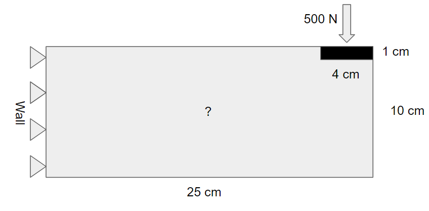
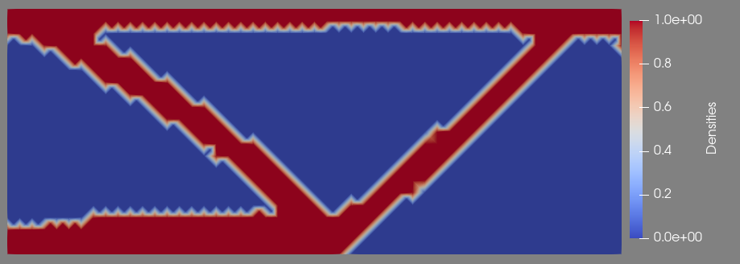
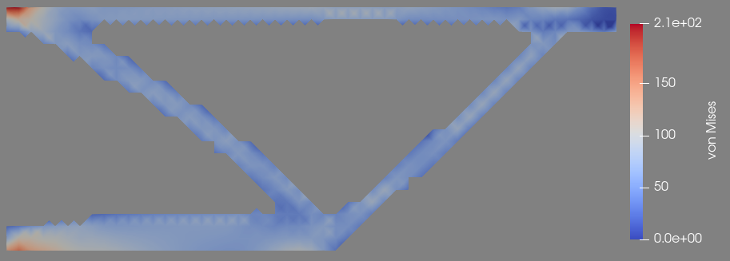

2D Cantilever Optimization
==========================

Introduction
------------

Suppose we want to make an aluminum shelf no taller than 10cm to best support an :math:`4\text{cm}` wide and :math:`80\text{cm}` long rod weighing :math:`500\text{N}` :math:`23\text{cm}` away from a wall while keeping the mass of the shelf under :math:`16.2\text{kg}`. This shelf will simply be a 2D profile extruded out of the page :math:`80\text{cm}` for ease of manufacturing, so we can just focus on optimizing the 2D profile. In order to ensure the rod is supported, we require that :math:`1\text{cm}` of material is present under it through its whole width. What is the best shape for the shelf to have? The design space can be summarized in a sketch:

This is known as the design domain of the problem. We want to figure out how to best support the rod while keeping the total mass of the shelf under :math:`16.2\text{kg}`. How do we express this mathematically?
First, let's find what fraction of our design domain can be filled with material. At any location, we can either have aluminum or not - there is no partial density. This means that :math:`16.2\text{kg} * \frac{1 \text{cm}^3}{2.7 g} = 6000 \text{cm}^3` can be filled with aluminum, which works out to :math:`\frac{6000 \text{cm}^3}{25\text{cm} * 10\text{cm} * 80 \text{cm}} = .3`, so up to 30% of the design domain can be filled with aluminum.
We also need to define "best support" as an objective function. We can do this by minimizing the compliance which can be defined as the sum of the strain energy in the part. Since we are operating in the elastic region we know that the strain energy in the part is equal to the input energy, or

.. math::
   \text{J} = \int_\Omega \langle \boldsymbol{F}, \boldsymbol{v} \rangle \text{dA}

Where :math:`\boldsymbol{F}` represents the applied forces at the subsurfaces :math:`\text{dA}` on the applied load region :math:`\Omega` and :math:`\boldsymbol{v}` represent the displacements on :math:`\text{dA}`. Importantly, :math:`\text{J}` is a single scalar value so it is simple to optimize. :math:`\text{J}` is a function of :math:`\boldsymbol{\rho}`, the density distribution in the region, which is a continuous value between 0 and 1. In the end we ideally want :math:`\boldsymbol{\rho}` to converge to 0 or 1 on each element.
In summary, we want to vary :math:`\boldsymbol{\rho} \in [0,1]` to minimize :math:`\text{J}(\boldsymbol{\rho})` while keeping :math:`\int_V \rho \text{dV} < 0.3\int_V 1 \text{dV}`, where V is the domain space. Further, :math:`\forall (x,y | x \in [21, 25] \cap y \in [9, 10]) \rightarrow \boldsymbol{\rho}(x,y) = 1`. In order to avoid the checkerboard problem we will add a filter term to :math:`\text{J}` to penalize too many changes in :math:`\boldsymbol{\rho}` with a weight, in this case

.. math::
   \text{J}_\text{filter} = 0.5\langle \nabla\boldsymbol{\rho},\nabla\boldsymbol{\rho} \rangle

---------------
Implementation
---------------
We start by first defining a standard Dolfin model to find the displacements in a 2D profile when a load is applied, much like the 2D Cantilever example, but this time this displacement will be as a function of a scalar function :math:`\boldsymbol{\rho}`. We will use a load of :math:`500\text{N}`, though the specific value of the load should not matter too much on the final result of the optimization as long as it isn't far too small or far too great. We start by defining the material properties, loads, mesh, and regions::

    from __future__ import print_function
    import numpy as np
    import region_selector_2d as rs
    from dolfin import *
    from dolfin_adjoint import *
    
    E = 69000.0 # N/mm^2
    nu = 0.33
    mu = E / (2.0*(1.0 + nu))
    lmbda = E*nu / ((1.0 + nu) * (1.0 - 2.0*nu))
    
    folder_name = './2d_cantilever_opt_results'
    
    length = 250.0 # [mm]
    thickness = 100.0 # [mm]
    resolution = .2 # [Nodes/mm]
    load = Constant((0.0,-500.0)) # [N]
    
    resX = int(resolution * length) # Num nodes in x axis
    resY = int(resolution * thickness) # Num nodes in y axis
    
    mesh = RectangleMesh(Point(0.0,0.0), Point(length, thickness), resX, resY, 'crossed')
    
    fixedRegion = rs.GetLinearBoundary.from_points(Point(0.0,0.0), Point(0.0,thickness))
    loadRegion = rs.GetLinearBoundary.from_points(Point(length-40.0, thickness), Point(length, thickness))
    
    boundaries = MeshFunction('size_t', mesh, mesh.topology().dim() - 1)
    boundaries.set_all(0)
    fixedRegion.mark(boundaries, 1)
    loadRegion.mark(boundaries, 2)
    
    boundaryfile = File('%s/simpleBoundaries.pvd' % folder_name)
    boundaryfile << boundaries

We will now define a region for the "frozen" region where the load is applied and :math:`\boldsymbol{\rho} = 0`::

    domains = MeshFunction('size_t', mesh, mesh.topology.dim())
    frozenLoadRegion = rs.GetRectangularRegion.from_points(Point(length, thickness), Point(length - 40.0, thickness - 10.0))
    
    domains.set_all(0)
    frozenLoadRegion.mark(domains, 1)
    
    domainfile = File('%s/simpleDomains.pvd' % folder_name)
    domainfile << domains
    
    ds = Measure('ds', domain=mesh, subdomain_data=boundaries)
    dx = Measure('dx', domain=mesh, subdomamin_data=domains)
    
    loadArea = assemble(Constant(1.0)*ds(2))
    scaledLoad = load / loadArea
    
    # Function space for displacements
    V = VectorFunctionSpace(mesh, "Lagrange", 1)
    # Function space for rho
    V0 = FunctionSpace(mesh, "Lagrange", 1)

Now we create the ``forward_linear`` function, which takes in a value for the :math:`\boldsymbol{\rho}` distribution in the region and the boundary conditions and returns the displacements. This requires an adaptation to the ``sigma`` method and an additional method to "encourage" the :math:`\boldsymbol{\rho}` values to tend towards 0 or 1, with a limit on how close the values can get to 0 to avoid division errors. The ``forward_linear`` function uses the values on ``dx`` to separately evaluate the non-frozen regions which will use the passed in :math:`\boldsymbol{\rho}` values and the frozen regions which will always use :math:`\boldsymbol{\rho} = 1`

::

    p = 4.0 # Penalization factor
    gamma = Constant(1e-2) # Min value
    
    def alpha(rho): # Penalization on intermediate values
        return gamma + (1-gamma) * rho**p
    
    def eps(u): 
        return sym(grad(u))
    
    def sigma(u, rho):
        return alpha(rho)*(lmda*tr(eps(u))*Identity(mesh.topology().dim()) + 2.0*mu*eps(u))
    
    def forward_linear(rho, bcs):
        du = TrialFunction(V)
        u = Function(V, name = "Displacement")
        v = TestFunction(V)
        
        a = inner(sigma(du, rho), eps(v)) * dx(0) + inner(sigma(du, Constant(1.0)), eps(v)) * dx(1)
        L = dot(scaledLoad, v) * ds(2)
        
        solve(a == L, u, bcs)
        return u

We now set up the optimization. We first define the boundary conditions and an initial guess for :math:`\boldsymbol{\rho}` and calculate the displacements for this guess::

    bc = DirichletBC(V, Constant((0.0,0.0)), fixedRegion)
    
    vf = 0.3 # Max volume fraction
    
    # Initial guess: uniform density with max volume fraction
    rho = interpolate(Constant(vf), V0)
    
    # Solve initial displacement for initial guess
    u = forward_linear(rho, bc)

Here we define a function which will be called after every step of the optimization. In this case we simply want it to print the current values for :math:`\boldsymbol{\rho}` so we can watch the progress of the optimization.

::

    iteration = File("%s/iterations.pvd" % folder_name)
    
    # Runs after every optimization iteration
    def derivative_cb(j, dj, m):
        m.rename("Densities", "Densities")
        iterations << m

We will now define the objective function and control for the minimization problem. Dolfin_adjoint uses the ``ReducedFunctional`` class to compute derivatives of the objective function with respect to the control, and it is what is used for the optimization::

    # Weights for each part of obj function
    dispW = Constant(1.0)
    filterW = Constant(5.0e-1)
    
    # Minimize strain energy
    Jdisp = assemble(dispW * dot(load,u)*ds(2))
    # Minimize gradient of rho
    Jfilter = assemble(filterW * inner(grad(rho), grad(rho)) * dx(0))
    
    J = Jdisp + Jfilter
    
    # Define control
    m = Constrol(rho)
    m_bounds = (0.0,1.0)
    
    # Define reduced functional
    Jhat = ReducedFunctional(J, m, derivative_cb_post = derivative_cb)

We will now set the volume constraint on :math:`\boldsymbol{\rho}`. This ``VolumeConstraint`` class will enforce the condition that the fraction of the volume (or the integral of :math:`\boldsymbol{\rho}` through the region) is less than a passed in ``volfrac``, in this case 0.3. 

::

    class VolumeConstraint(InequalityConstraint):
        def __init__(self, volfrac):
            self.volfrac = volfrac
            self.smass = assemble(TestFunction(V0)*Constant(1.0)*dx)
            self.smassNotFrozen = assemble(TestFunction(V0)*Constant(1.0)*dx(0))
            self.smassFrozen = assemble(TestFunction(V0)*Constant(1.0)*dx(1))
            self.rhovec = Function(V0)
            self.rhovecFrozen = interpolate(Constant(1.0),V0)
        
        def function(self, m):
            from pyadjoint.reduced_functional_numpy import set_local
            set_local(self.rhovec, m) # Set rhovec to the control, rho
            integralNotFrozen = self.smassNotFrozen.inner(self.volfrac - self.rhovec.vector())
            integralFrozen = self.smassFrozen.inner(self.volfrac - self.rhovecFrozen.vector())
            
            return integralNotFrozen + integralFrozen # Keep this >= 0
        
        def jacobian(self, m):
            return [-self.smass]
        
        def output_workspace(self):
            return [0.0]

We can now finally define the minimization problem, set some parameters, and solve for :math:`\boldsymbol{\rho}`.

::

    problem = MinimizationProblem(Jhat, bounds = m_bounds, constraints = VolumeConstraint(vf))
    parameters = {"max_iter": 500, 'linear_solver': 'ma97', 'tol': 1e-3, 'acceptable_tol': 1e-3, 'acceptable_iter': 10}
    
    solver = IPOPTSolver(problem, parameters = parameters)
    rho_opt = solver.solve()

As this code is running we can open ParaView and open the iterations.pvd file to view the progress of the optimization. Note that the frozen region's :math:`\boldsymbol{\rho}` value is not 1 - this is because the values of :math:`\boldsymbol{\rho}` in that region are never even read and are always set to 1 in calculations. In post processing we set these values to 1, compute the displacements one last time, and write the results to a file. We can also compute other metrics for evaluating the design. In this case, we will also compute the von Mises stress.

::

    # Post Processing
    u = forward_linear(rho_opt, bc)
    u.rename("Displacement", "Displacement")
    
    v2d = vertex_to_dof_map(V0)
    index_inside_pad = []
    
    # Mark all frozen regions
    for i,x in enumerate(mesh.coordinates()):
        if frozenLoadRegion.inside(x,True): index_inside_pad.append(i)
    
    rho_opt.vector()[v2d[index_inside_pad]] = Constant(1.0)
    rho.assign(rho_opt)
    rho.rename("Densities", "Densities")
    
    # von Mises Stress
    stress = sigma(u,rho)
    s = stress - (1./3)*tr(stress)*Identity(2)  # deviatoric stress
    von_Mises = sqrt(3./2*inner(s,s))
    Vvm = FunctionSpace(mesh,'P',1)
    von_Mises = project(von_Mises,Vvm)
    von_Mises.rename("von Mises","von Mises")
    
    xdmf_file = XDMFFile('%s/results.xdmf' % folder_name)
    
    xdmf_file.parameters["flush_output"] = True
    xdmf_file.parameters["functions_share_mesh"] = True
    xdmf_file.parameters["rewrite_function_mesh"] = False
    xdmf_file.write(rho, 1.0)
    xdmf_file.write(u, 1.0)
    xdmf_file.write(von_Mises,1.0)

The post processed final shape is:

And when a threshold to only show the areas with :math:`\boldsymbol{\rho} > 0.8` and change the coloring to von Mises Stress we get:

-------------
Complete Code
-------------
The complete code follows and can also be downloaded :download:`here </code/2d_cantilever_opt.py>`.

.. literalinclude:: /code/2d_cantilever_opt.py
   :language: python