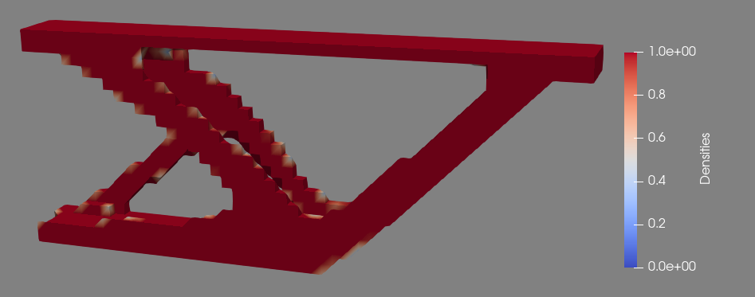

3D Cantilever Optimization
==========================
Introduction
------------
Dolfin and dolfin-adjoint make it very simple to convert 2D optimization problems to 3D - you just have to adjust your coordinate systems, but as long as your governing equations extend to 3D the rest of the optimization should work.

--------------
Implementation
--------------
To switch from 2D to 3D, we will need to change:
* Define third dimension
* Mesh Definition (e.g. RectangleMesh to BoxMesh)
* Adjust vectors to all be 3D (e.g. load vector, DirichletBC position)
* Change region definitions (e.g. GetLinearBoundary to GetPlanarBoundary)

And that's all! Our governing equations to solve for the displacement of the piece still apply in 3D, all of the logic for using the selected regions in the FEniCS simulation still holds, and the optimization control on density will automatically expand to 3D as the mesh is adjusted. Try to adjust the 2D Cantilever Optimization to 3D on your own by adding a 25mm width to the mesh and compare your results:

Note how even though this is a pretty simple optimization, the program still takes much longer to run in 3D than in 2D (the 3D version took about half an hour on my computer). The solution is a hollow part, and if we imagine the left half and right half of solving the same problem separately, it appears that they converged to two different solutions of the same problem. When we watch the progress of the simulation, it seems that because the right side connected from the top to the bottom in a straight diagonal line before the support beam from the bottom had the chance to connect, that support beam was extraneous and moved to the left side to complete a 3-point support. While increasing the allowed volume fraction may help, the solved solution will not be a solution to our problem which requires a volume fraction of 30%.
In a broader sense, the issue we are observing is premature convergence to a local minimum. We will go in to more detail on methods of avoiding premature convergence, but for now we will "fix" this problem using a symmetry constraint which will make the left and right side match. There are a few methods of implementing a symmetry constraint, but the simplest method is to halve the domain along Z and create a Dirichlet boundary condition along the mirror plane that prevents motion in the Z direction.

Make the following changes:

::

    width = 25.0/2.0 # [mm]
    ...
    load = Constant((0.0, -500.0/2.0, 0.0)) # [N]
    ...
    midplane = rs.GetPlanarBoundary(\
            Point(0.0,0.0,0.0),\
            Point(0.0,thickness,0.0),\
            Point(length,thickness,0.0),\
            Point(length,0.0,0.0))
    ...
    bc1 = DirichletBC(V, Constant((0.0,0.0,0.0)), fixedRegion)
    bc2 = DirichletBC(V.sub(2), Constant(0.0), midplane)
    ...
    u = forward_linear(rho, [bc1, bc2])

This creates a problem whose optimal solution should be able to be mirrored across the Z=0 plane to get an optimal solution to our original problem. Since the domain space is smaller now, we can also afford to increase the resolution in the Z direction to avoid problems with granularity that may arise from shrinking the domain space.