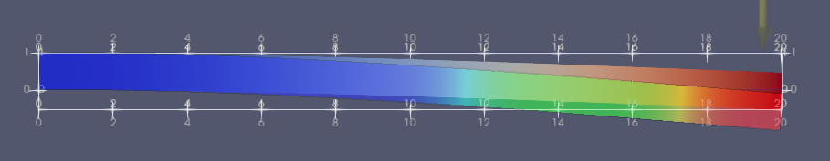

3D Cantilever Beam Simulation
=============================

We can make a 3D cantilever beam simulation almost identically to how we made the 2D cantilever beam. We start by defining a mesh for a beam::

    from __future__ import print_function
    import numpy as np
    import region_selector_3d as rs
    from dolfin import *
    
    length = 20.0 # [mm]
    width = 2.0 # [mm]
    thickness = 1.0 # [mm]
    resolution = 2 # [Nodes/mm]
    
    resX = int(resolution * length) # Num nodes in x axis
    resY = int(resolution * width) # Num nodes in y axis
    resZ = int(resolution * thickness) # Num nodes in z axis
    
    mesh = BoxMesh(Point(0.0,0.0,0.0), Point(length, width, thickness), resX, resY, resZ)

We will now label the fixed and load regions using ``region_selector_3d``. We will fix the face at :math:`x=0` and apply the load on the last 1mm on the top face of the beam furthest from the fixed end::

    fixedRegion = rs.GetPlanarBoundary.from_coord('x', 0.0)
    loadRegion = rs.GetPlanarBoundary.from_points(\
        Point(length, 0.0, thickness),\
        Point(length, width, thickness),\
        Point(length - 1.0, width, thickness),\
        Point(length - 1.0, 0.0, thickness))
    
    boundaries = MeshFunction('size_t', mesh, mesh.topology().dim()-1)
    boundaries.set_all(0)
    fixedRegion.mark(boundaries,1)
    loadRegion.mark(boundaries,2)
    
    folder_name = './3d_cantilever_results'
    boundaryfile = File('%s/boundaries.pvd' % folder_name
    boundaryfile << boundaries
    
    ds = Measure('ds', domain = mesh, subdomain_data = boundaries)

ParaView lets us see our defined domains.

.. image:: 3d_cantilever_beam_mesh_02.png

We can see that the entire near face is marked 1, and the final milimeter of the top face is labeled 2, matching our description. The rest of the code is nearly identical to the 2D cantilever beam simulation. In this example we'll be showing how to adjust the load to more closely represent a single load, in this case :math:`-5 \text{N}` in the Z direction, rather than the load distribution that was used in the 2D example. We will define our desired load in :math:`\text{N}` and then convert it to :math:`\frac{\text{N}}{\text{mm}^2}` by dividing by the area of the load region. This only works when the mesh marked load region and the region selector class match exactly.

::

    E = 68900.0 # [N/mm^2]
    nu = 0.33 # Poisson's ratio
    mu = E / (2.0 * (1.0 + nu))
    lmbda = E*nu / ((1.0 + nu) * (1.0-2.0*nu))
    
    load = Constant((0.0,0.0,-5.0)) # [N]
    loadArea = loadRegion.area()
    scaledLoad = load / loadArea
    
    def eps(u):
        return sym(grad(u))
    
    def sigma(u):
        return lmbda*tr(eps(u)) * Identity(mesh.topology.dim()) + 2.0*mu*eps(u)
    
    V = VectorFunctionSpace(mesh, "Lagrange", 1)
    du = TrialFunction(V)
    u = Function(V, name="Displacement")
    v = TestFunction(V)
    
    a = inner(sigma(du), eps(v))*dx
    L = dot(scaledLoad,v)*ds(2)
    
    bc = DirichletBC(V, Constant((0.0,0.0,0.0)), fixedRegion)
    
    solve(a == L, u, bc)
    
    u.rename("Displacement", "Displacement")
    xdmf_file = XDMFFile('%s/results.xdmf' % folder_name)
    xdmf_file.write(u,1.0)

.. image:: 3d_cantilever_beam_results_02.png

Our simulation indicates that under a :math:`5 \text{N}` downwards load, a cantilevered aluminum beam (E = :math:`68900 \frac{\text{N}}{\text{mm}^2}`, nu = :math:`0.33`) that is :math:`20\text{mm}` long, :math:`2\text{mm}` wide, and :math:`1\text{mm}` thick will deflect about :math:`0.53\text{mm}` downwards. Let's compare that to Autodesk Inventor's stress analysis simulation:

The rainbow colored one is from Inventor. So why do the results disagree so much? It seems like the Inventor simulation has the beam displace about twice as much. The reason is that the Fenics model's approximation is too broad. If we want to find more exact results, we change the line::

    V = VectorFunctionSpace(mesh, "Lagrange", 1)

to::

    V = VectorFunctionSpace(mesh, "Lagrange", 2)

This makes the simulation take longer to run, but the results now match near exactly.

.. image:: 3d_cantilever_beam_results_overlay_04.PNG

The new displacement, :math:`1.1\text{mm}`, matches the Euler-Bernoulli calculation for the deflection of this beam.

-------------
Complete Code
-------------
The complete code follows and can also be downloaded :download:`here </../code/3d_cantilever_beam.py>`.

.. literalinclude:: /../code/3d_cantilever_beam.py
   :language: python